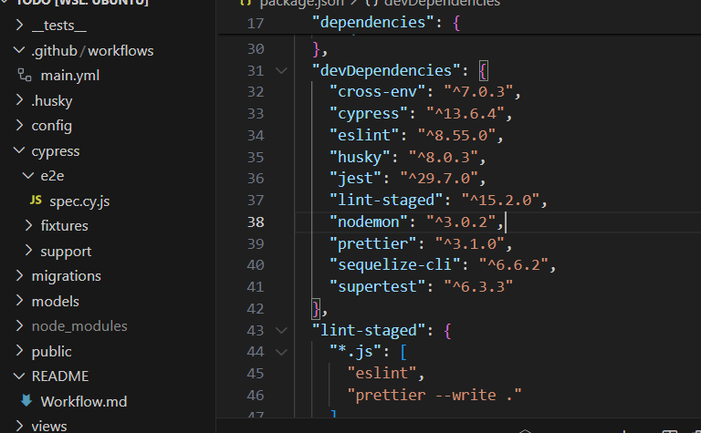
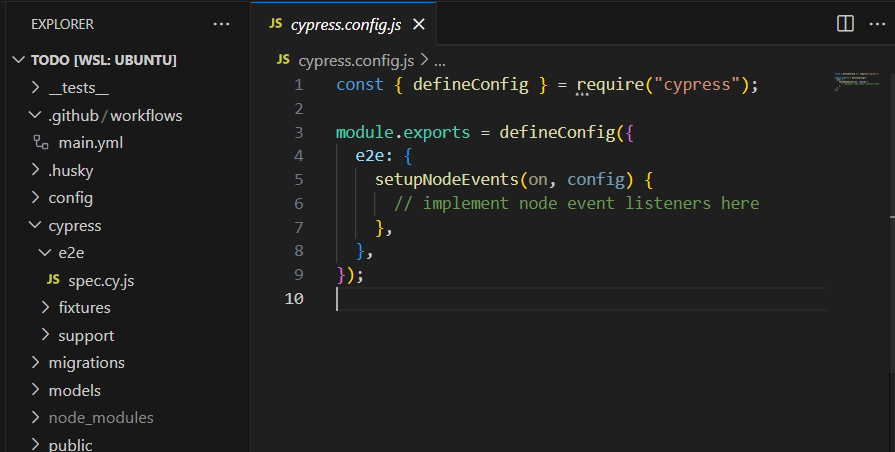
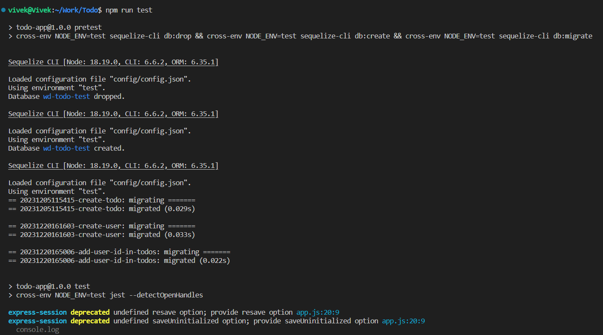
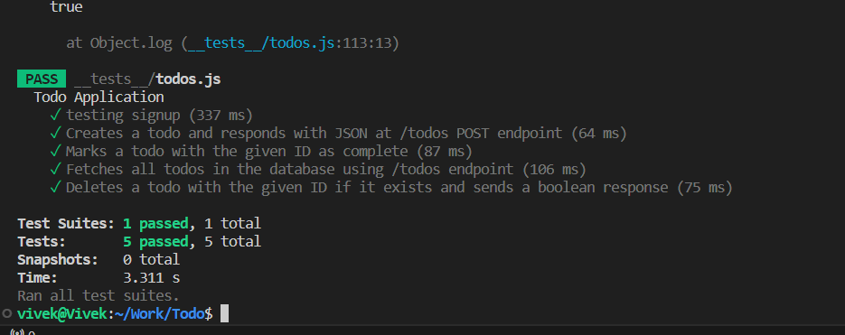
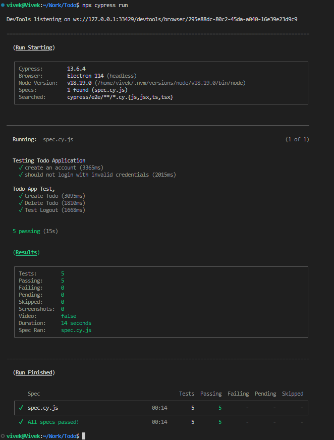
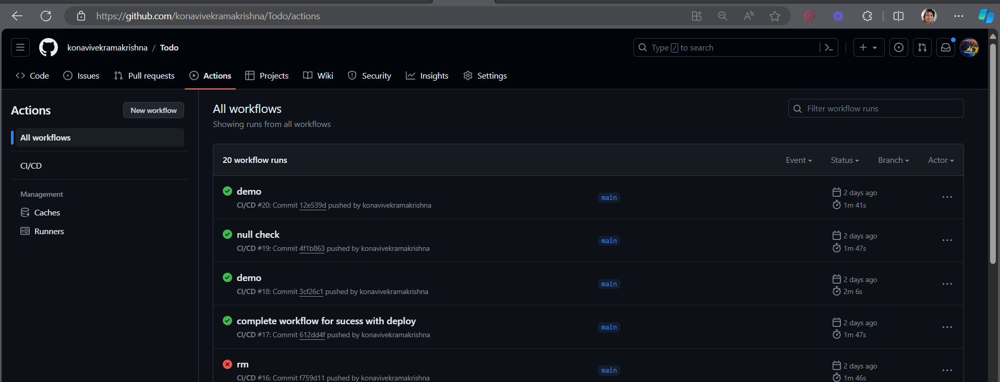

### Configuration of Testing Framework:

- Utilizes Jest as the testing framework.
- Configured in the package.json file under the "scripts" section.
- Test script: "test": "cross-env NODE_ENV=test jest --detectOpenHandles".
- Sets the environment variable NODE_ENV to test.
- Executes Jest for running the tests, ensuring proper environment setup.

### Test Suite Coverage:

- Comprehensive coverage of various functionalities of the Todo application.
- Includes unit tests and integration tests.
- Unit tests implemented using Jest, covering individual components and functions.
- Integration tests performed using Supertest to test API endpoints.
- End-to-end tests conducted using Cypress to simulate user interactions.

### Automatic Test Suite Execution on GitHub:

- Configured to automatically execute the test suite upon pushing changes to GitHub using GitHub Actions.
- Workflow defined in .github/workflows/main.yml file.
- Triggered on push events.
- Sets up a PostgreSQL service container for running tests against a test database.
- Checks out the repository, installs dependencies, sets up the test database, and executes unit tests using Jest.
- Runs the application, sets up the environment, and executes integration tests using Cypress.

### GitHub Actions Walkthrough:

- Starts by defining the name of the workflow and specifying the triggers.
- Sets up a PostgreSQL service container for the test database.
- Checks out the repository code and installs dependencies using npm ci.
- Sets up the test database by running Sequelize commands to drop, create, and migrate the database schema.
- Runs unit tests using Jest.
- Installs Cypress and executes integration tests to validate the functionality of the application.

### Conclusion:

- Demonstrates a robust testing setup with Jest, Supertest, and Cypress.
- Automatic test suite execution on GitHub using GitHub Actions ensures continuous testing.
- Helps maintain code quality by detecting regressions early in the development process.
- Provides a comprehensive solution for ensuring the reliability and functionality of the Todo application.

### Dev Dependencies:

```json
 "devDependencies": {
    "cross-env": "^7.0.3",
    "cypress": "^13.6.4",
    "eslint": "^8.55.0",
    "husky": "^8.0.3",
    "jest": "^29.7.0",
    "lint-staged": "^15.2.0",
    "nodemon": "^3.0.2",
    "prettier": "^3.1.0",
    "sequelize-cli": "^6.6.2",
    "supertest": "^6.3.3"
  }


```



### Cypress Configuration:

```javascript
const { defineConfig } = require("cypress");

module.exports = defineConfig({
  e2e: {
    setupNodeEvents(on, config) {
      // implement node event listeners here
    },
  },
});
```



### Jest Test suite:

```javascript
const request = require("supertest");

const db = require("../models/index");
const app = require("../app");

let server, agent;

describe("Todo Application", function () {
  beforeAll(async () => {
    await db.sequelize.sync({ force: true });
    server = app.listen(3008 || process.env.PORT, () => {});
    agent = request.agent(server);
  });
  afterAll(async () => {
    await db.sequelize.close();
    server.close();
  });

  test("testing signup", async () => {
    let res = await agent.get("/signup");

    res = await agent.post("/users").send({
      firstName: "test",
      lastName: "test",
      email: "test@gmail.com",
      password: "12345678",
    });

    expect(res.statusCode).toBe(302);
  });

  test("Creates a todo and responds with JSON at /todos POST endpoint", async () => {
    const response = await agent
      .post("/todos")
      .set("Accept", "application/json")
      .send({
        title: "Buy silk",
        dueDate: new Date().toISOString(),
        completed: false,
      });

    expect(response.statusCode).toBe(200);
  });

  test("Marks a todo with the given ID as complete", async () => {
    const createResponse = await agent
      .post("/todos")
      .set("Accept", "application/json")
      .send({
        title: "Buy tilk",
        dueDate: new Date().toISOString(),
        completed: false,
      });

    const todoID = createResponse.body.id;
    expect(createResponse.body.completed).toBe(false);

    const markCompleteResponse1 = await agent
      .put(`/todos/${todoID}`)
      .set("Accept", "application/json")
      .send({
        completed: false,
      });
    const parsedUpdateResponse = markCompleteResponse1.body;
    expect(parsedUpdateResponse.completed).toBe(true);
    const markCompleteResponse2 = await agent
      .put(`/todos/${todoID}`)
      .set("Accept", "application/json")
      .send({
        completed: true,
      });

    const parsedUpdateResponse2 = markCompleteResponse2.body;
    expect(parsedUpdateResponse2.completed).toBe(false);
  });

  test("Fetches all todos in the database using /todos endpoint", async () => {
    await agent.post("/todos").send({
      title: "Buy xbox",
      dueDate: new Date().toISOString(),
      completed: false,
    });
    await agent.post("/todos").send({
      title: "Buy ps3",
      dueDate: new Date().toISOString(),
      completed: false,
    });
    const response = await agent
      .set("Accept", "application/json")
      .get("/todos");
    const parsedResponse = JSON.parse(response.text);
    console.log(parsedResponse);
    expect(parsedResponse.todaydues.length).toBe(4);
    expect(parsedResponse["todaydues"][3]["title"]).toBe("Buy ps3");
  });

  test("Deletes a todo with the given ID if it exists and sends a boolean response", async () => {
    const response = await agent
      .post("/todos")
      .set("Accept", "application/json")
      .send({
        title: "Buy milk",
        dueDate: new Date().toISOString(),
        completed: false,
      });

    expect(response.statusCode).toBe(200);
    expect(response.header["content-type"]).toMatch(/application\/json/);

    const parsedResponse = JSON.parse(response.text);
    const todoID = parsedResponse.id;
    const response2 = await agent.delete(`/todos/${todoID}`);
    console.log(response2.text);
    const parsedResponses = JSON.parse(response2.text);
    expect(parsedResponses).toBe(true);
  });
});
```




### Cypress Test Suite:

```javascript
let baseUrl = "http://localhost:3000";

const generateRandomEmail = () => {
  const timestamp = new Date().getTime();
  return `user${timestamp}@example.com`;
};

function getCurrentDateFormatted() {
  const today = new Date();
  const year = today.getFullYear();
  const month = String(today.getMonth() + 1).padStart(2, "0");
  const day = String(today.getDate()).padStart(2, "0");

  return `${year}-${month}-${day}`;
}

const email = generateRandomEmail();

describe("Testing Todo Application", () => {
  it("create an account", () => {
    cy.visit(baseUrl + "/signup");

    cy.get('input[name="firstName"]').type("vivekvivek");
    cy.get('input[name="email"]').type(email);
    cy.get('input[name="password"]').type("vivekvivek");

    cy.get('input[name="lastName"]').type("vivekvivek");

    cy.get('button[type="submit"]').click();
    cy.wait(500);
    cy.location().should((loc) => {
      expect(loc.pathname).to.eq("/todos");
    });
  });
  it("should not login with invalid credentials", () => {
    cy.visit(baseUrl + "/login");
    cy.get('input[name="email"]').type(email);
    cy.get('input[name="password"]').type("inv@lid");
    cy.get('button[type="submit"]').click();
    cy.wait(500);
    cy.location().should((loc) => {
      expect(loc.pathname).to.eq("/login");
    });
  });
});

describe("Todo App Test,", () => {
  beforeEach(() => {
    cy.visit(baseUrl + "/login");

    cy.get('input[name="email"]').type(email);
    cy.get('input[name="password"]').type("vivekvivek");
    cy.get('button[type="submit"]').click();
  });

  it("Create Todo", () => {
    cy.get('input[name="title"]').type("Sample due later item");
    cy.get('input[name="dueDate"]').type(getCurrentDateFormatted());

    cy.get('button[type="submit"]').click();
    cy.wait(500);
    cy.get(".Todo-Item").should("exist");
    cy.get("#count-due-today").contains("1");
  });

  it("Delete Todo", () => {
    cy.contains("label", "Sample due later item")
      .next("a")
      .trigger("mouseover", { force: true })
      .click({ force: true });
    cy.get("#count-overdue").contains("0");
  });

  it("Test Logout", () => {
    cy.contains("signout", { matchCase: false }).click({ force: true });
    cy.location().should((loc) => {
      expect(loc.pathname).to.eq("/");
    });
  });
});
```



### Github Actions Walkthrough:

```yaml
name: CI/CD
# Triggers the workflow on every push event
on: push

# Environment variables

env:
  PG_DATABASE: "${{ secrets.POSTGRES_DATABASE }}"
  PG_USER: "${{ secrets.POSTGRES_USER }}"
  PG_PASSWORD: "${{ secrets.POSTGRES_PASSWORD }}"

# Jobs
jobs:
  # Job to run tests

  run-tests:
    # Runs on Ubuntu latest version

    runs-on: ubuntu-latest

    # Define a PostgreSQL service for running tests
    services:
      postgres:
        image: postgres:11.7
        env:
          POSTGRES_USER: "postgres"
          POSTGRES_PASSWORD: "postgres"
          POSTGRES_DB: "wd-todo-test"
        options: >-
          --health-cmd pg_isready
          --health-interval 10s
          --health-timeout 5s
          --health-retries 5
        ports:
          - 5432:5432

    # Steps to execute within the job
    steps:
      # Check out repository code
      - name: Check out repository code
        uses: actions/checkout@v3

        # Install dependencies
      - name: Install dependencies
        run: npm ci
      # Run unit tests
      - name: Run unit tests
        run: npm test
      # Run the app
      - name: Run the app
        id: run-app
        run: |
          npx sequelize-cli db:drop
          npx sequelize-cli db:create
          npx sequelize-cli db:migrate
          PORT=3000 npm start &
          sleep 5
      # Run integration tests
      - name: Run integration tests
        run: |
          npm install cypress cypress-json-results
          npx cypress run

  # Job to deploy the app to production
  deploy:
    # Define the job dependencies
    needs: run-tests
    runs-on: ubuntu-latest
    if: needs.run-tests.result == 'success'

    # Steps to execute within the job
    steps:
      # Deploy to production using a custom action
      - name: Deploy to production
        uses: johnbeynon/render-deploy-action@v0.0.8
        with:
          service-id: "${{ secrets.MY_RENDER_SERVICE_ID }}"
          api-key: "${{ secrets.MY_RENDER_API_KEY }}"

  # Job to send Slack notifications
  notify:
    # Define the job dependencies
    needs: [run-tests, deploy]
    runs-on: ubuntu-latest

    if: ${{ always() }}
    steps:
      - name: Send Slack notification on success

        # Send a Slack notification if the tests and deployment are successful
        if: ${{ needs.run-tests.result == 'success' && needs.deploy.result == 'success' }}
        uses: slackapi/slack-github-action@v1.25.0
        with:
          payload: |
            {
              "text": "CI/CD process succeeded!" 
            }
        env:
          SLACK_WEBHOOK_URL: ${{ secrets.SLACK_WEBHOOK_URL }}

      - name: Send Slack notification on failure
        if: ${{ needs.run-tests.result != 'success' || needs.deploy.result != 'success' }}
        uses: slackapi/slack-github-action@v1.25.0
        with:
          payload: |
            {
              "text": "*${{ github.workflow }}* failed. Access the details https://github.com/${{ github.repository }}/actions/runs/${{ github.run_id }}."
               
            }
        env:
          SLACK_WEBHOOK_URL: ${{ secrets.SLACK_WEBHOOK_URL }}
```



This GitHub Actions workflow automates the Continuous Integration (CI) and Continuous Deployment (CD) process for a Node.js application. The workflow consists of three main jobs:

### jobs:

1. **run-tests**: This job runs on the latest version of Ubuntu and defines a PostgreSQL service for running tests. The steps include checking out the repository code, installing dependencies, running unit tests, running the application, and executing integration tests using Cypress.

2. **deploy**: This job runs on the latest version of Ubuntu and is triggered if the run-tests job is successful. It deploys the application to production using a custom action that interacts with the Render platform.

3. **notify**: This job sends Slack notifications based on the success or failure of the tests and deployment. It includes steps to send Slack notifications using the slackapi/slack-github-action action.

The workflow is triggered on every push event to the repository.

## Env Variables

```yaml
env:
  PG_DATABASE: "${{ secrets.POSTGRES_DATABASE }}"
  PG_USER: "${{ secrets.POSTGRES_USER }}"
  PG_PASSWORD: "${{ secrets.POSTGRES_PASSWORD }}"
  MY_RENDER_SERVICE_ID: "${{ secrets.MY_RENDER_SERVICE_ID }}"
  MY_RENDER_API_KEY: "${{ secrets.MY_RENDER_API_KEY }}"
  SLACK_WEBHOOK_URL: "${{ secrets.SLACK_WEBHOOK_URL }}"
```

The workflow demonstrates a comprehensive CI/CD setup for a Node.js application, including testing, deployment, and notifications.
